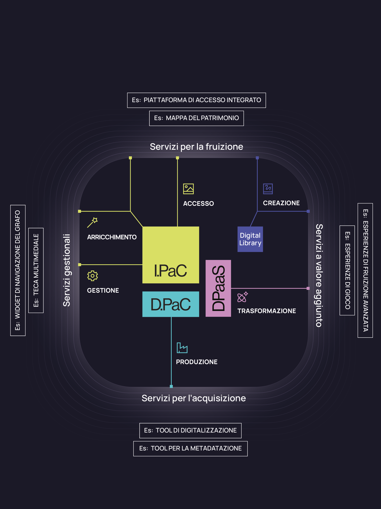

Quali servizi offre Ecomic ai Destinatari  ?
============================================

Gli Attori   dell’ecosistema sfruttano i servizi Ecomic per creare o potenziare i servizi e le soluzioni digitali rivolte ai propri Destinatari. Questa sezione presenta le principali categorie di servizi sviluppati dagli Attori, evidenziando come ciascuno possa beneficiare dei servizi Ecomic.

I servizi rivolti ai Destinatari   che sono abilitati o potenziati da Ecomic sono definiti in continuità con la classificazione proposta dal PND:

-  :term:`servizi per la fruizione <Servizio per la fruizione>`  

-  :term:`servizi gestionali <Servizio gestionale>`  

-  servizi a valore aggiunto  

-  Servizi per l’acquisizione

Servizi per la fruizione  
------------------------

I servizi per la fruizionesono progettati per offrire ai Destinatari   — cittadini, ricercatori, studenti, professionisti — strumenti digitali per esplorare, consultare e comprendere il patrimonio culturale digitale. Questi servizi sono l’espressione della valorizzazione promossa da Ecomic: beni digitali   accessibili, inclusivi e attivabili nei contesti sociali, educativi, civici e creativi.

Grazie ai servizi del nucleo tecnologico, queste piattaforme possono offrire esperienze di fruizione intelligenti e multidimensionali, basate su modelli semantici condivisi e su una forte integrazione tra contenuti, metadati e funzionalità.

Rientrano in questa categoria: portali e applicazioni di accesso al patrimonio a livello nazionale (es. Catalogo generale dei beni culturali   dell’ICCD), territoriale, tematico; sistemi di navigazione semantica; visualizzatori avanzati; mappe tematiche e interattive; interfacce conversazionali; aggregatori culturali nazionali, regionali o internazionali (es. Europeana).

Piattaforma di accesso integrato
~~~~~~~~~~~~~~~~~~~~~~~~~~~~~~~~

Tra i sistemi per l’accesso e la fruizione assume particolare rilevanza la Piattaforma di accesso integrato, sviluppata da Digital Library nell’ambito del sub-investimento PNRR M1C3 1.1.10, concepita come uno dei principali punti di accesso pubblico al patrimonio culturale digitale.

La Piattaforma è una delle espressioni più visibili dei servizi di Ecomic sviluppati da Digital Library: aggrega i beni digitali   ospitati in I.PaC restituendoli in un’unica interfaccia intuitiva orientata all’esplorazione e alla scoperta da parte di un ampio pubblico di Destinatari.

La Piattaforma consente a ricercatori, studenti, cittadini, turisti, educatori e professionisti del settore culturale e di settori collegati (es. grafica) di ricercare, navigare ed esplorare il patrimonio digitale, consultare le descrizioni e i risultati dell’arricchimento operato dai servizi di IA, ottenere riproduzioni nel rispetto dei profili di protezione e di visibilità applicati, creare percorsi e narrazioni personalizzate.

Servizi gestionali  
------------------

I servizi gestionalisono dedicati all’organizzazione, conservazione e amministrazione dei beni digitali   lungo l’intero ciclo di vita informativo e operativo. Non sono rivolti direttamente ai Destinatari, ma permettono a istituzioni culturali, enti pubblici e operatori professionali coinvolti nella gestione del patrimonio digitale di operare sui propri beni digitali.

Questi servizi sono fondamentali per garantire la qualità, la tracciabilità e la disponibilità nel tempo dei beni digitali. Contribuiscono pertanto in modo determinante agli obiettivi di interoperabilità e di abilitazione di Ecomic, consentendo di mantenere un patrimonio digitale aggiornato, coerente e integrabile nel tempo, secondo standard condivisi e pratiche sostenibili.

Rientrano in questa categoria: sistemi informativi di gestione del patrimonio digitale (es. archivi digitali, *library management systems*); sistemi per la conservazione digitale a norma; ambienti per il versionamento e l’editing; strumenti per la validazione, la normalizzazione e la pubblicazione.

Servizi a valore aggiunto  
-------------------------

I servizi a valore aggiuntocomprendono interventi creativi, educativi, espositivi e commerciali che utilizzano i beni digitali per generare nuovi prodotti, esperienze o conoscenze. Si tratta di servizi orientati alla trasformazione del patrimonio digitale in valore, anche attraverso forme ibride che coniugano ricerca, mediazione culturale, tecnologie immersive e strumenti di partecipazione. Sono spesso realizzati in collaborazione con imprese culturali, tecnologiche e creative, e rappresentano un ambito strategico per la valorizzazione economica e sociale del patrimonio.

L’obiettivo di Ecomic in questo ambito è duplice: da un lato, valorizzare il patrimonio in chiave esperienziale e generativa, dall’altro, abilitare nuovi modelli di collaborazione pubblico-privato **per l’innovazione** nei servizi culturali. I servizi di trasformazione offerti da DPaaS e le iniziative a supporto di co-progettazione e riuso garantite da Digital Library, offrono le basi per lo sviluppo sostenibile di questi servizi, in coerenza con gli obiettivi strategici dell’ecosistema.

Rientrano in questa categoria: strumenti di narrazione e *storytelling* interattivo; esperienze ludiche e videogame; applicazioni XR per la visita immersiva; app per la creazione di percorsi personalizzati e contenuti adattivi; soluzioni per l’accessibilità aumentata (es. traduzioni LIS, audio descrizioni); ambienti per la co-creazionee il riuso partecipativo.

Servizi per l’acquisizione
--------------------------

I servizi per l'acquisizione  supportano la produzione di beni digitali   (ivi compresi metadati e descrizioni), attraverso due modalità principali: la digitalizzazione di beni culturali   e l’acquisizione di :term:`beni digitali nativi <Digitale nativo>`  \ . Questi servizi consentono il popolamento dell’infrastruttura e dei diversi sistemi secondo standard tecnici e descrittivi, abilitando l’avvio del ciclo di vita del bene digitale.

Ecomic intende abilitare un’ampia platea di Attori   alla produzione di beni digitali   conformi, garantendo coerenza semantica, interoperabilità e riuso futuro sin dalla fase di acquisizione.

Rientrano in questa categoria: piattaforme software a supporto della digitalizzazione; strumenti per il collaudo e la *data-quality*; soluzioni per l’acquisizione avanzata (modelli 3D, digital twin e multispettrale); strumenti per la raccolta e l’acquisizione di contenuti nativi digitali\ ; moduli di descrizione  e catalogazione del patrimonio.
